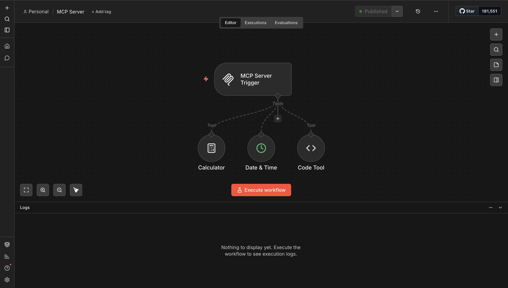
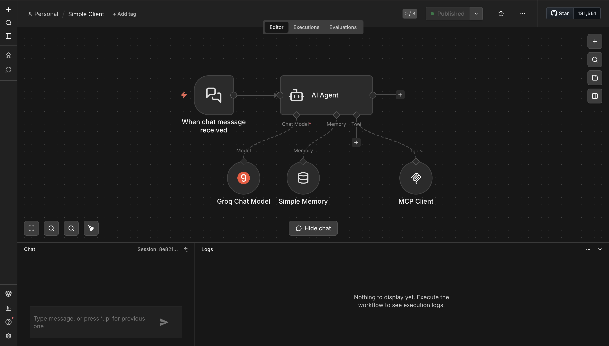
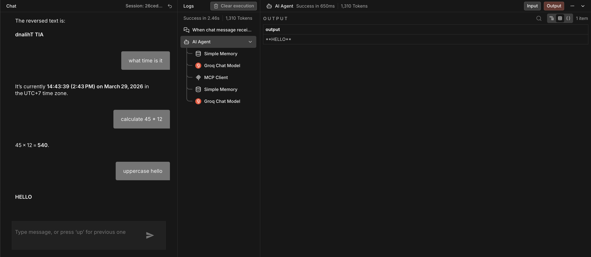
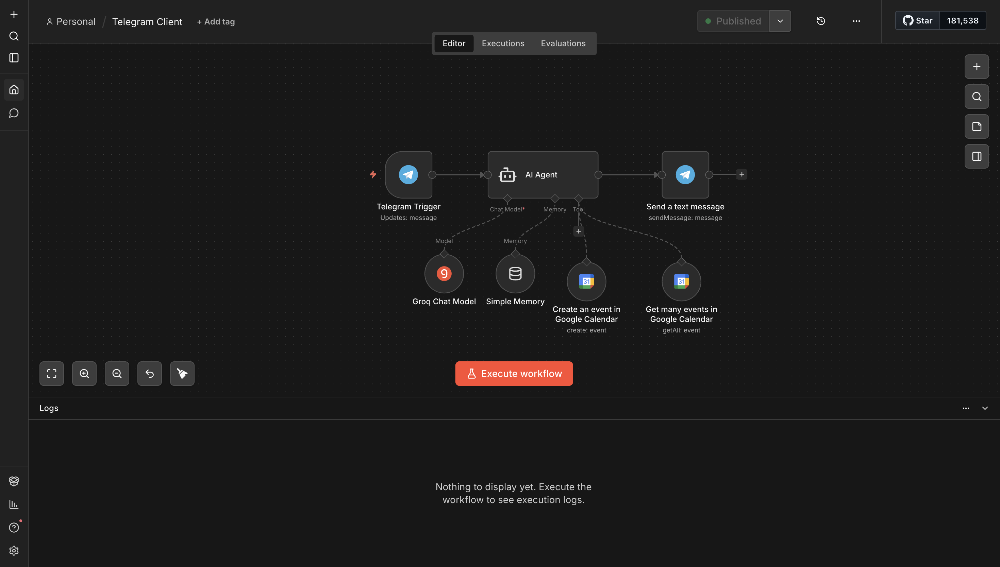
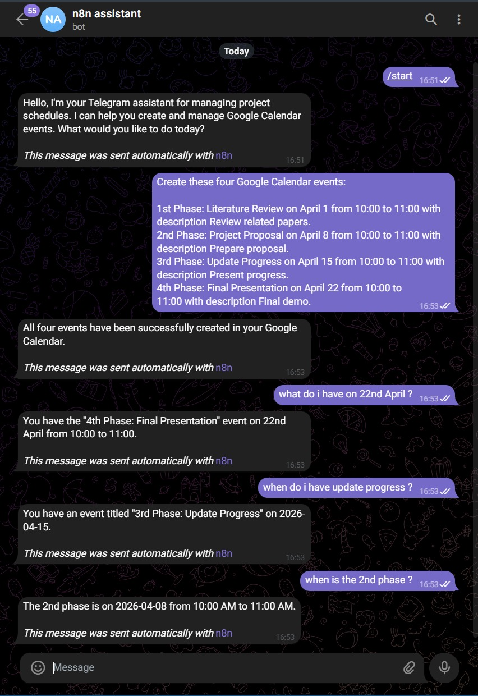
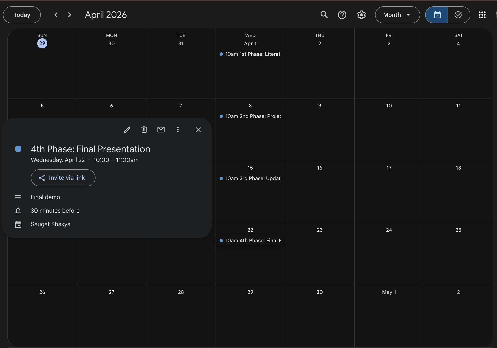

# Assignment 7: AI Agent & MCP Integration

**Student Name:** Saugat Shakya (st125986)
**Student ID:**
**Course:** AT82.05 Natural Language Understanding (NLU)
**Date:** March 29, 2026

---

## Overview

This assignment demonstrates the development of an AI-powered system integrating:

* MCP (Model Context Protocol) Server with multiple tools
* AI Agent capable of tool-based reasoning
* Telegram bot for user interaction
* Google Calendar for real-world event automation

The system allows users to interact via natural language to create and verify calendar events.

---

## Task 1: MCP Infrastructure & AI Agent Setup

### Objective

To set up an MCP Server with tools and connect it to an AI Agent capable of using those tools through chat.

### Implementation

* Deployed n8n using Docker
* Exposed the service using ngrok
* Created an MCP Server workflow with:
  * Calculator Tool
  * Date & Time Tool
  * Code Tool (text manipulation)
* Built a separate AI Agent workflow using:
  * Groq Chat Model
  * Simple Memory for conversational context
  * MCP Client connected to MCP Server Production URL

### Figure 1: MCP Server Workflow

*MCP Server Trigger with three connected tools: Calculator, Date & Time, and Code Tool*

### Figure 2: AI Agent (Simple Client) Workflow

*AI Agent connected to Groq Chat Model, Simple Memory, and MCP Client as tool*

### Figure 3: MCP Tool Usage via Chat

*AI Agent chat demonstrating successful MCP tool usage: text reversal, time query, arithmetic calculation, and uppercase transformation*

### Results

The AI Agent successfully:

* Connected to MCP Server and discovered tools dynamically
* Used the Date & Time tool to return current local time (14:43:39 UTC+7)
* Used the Calculator tool to compute 45 × 12 = 540
* Used the Code Tool to reverse text and convert to uppercase

---

## Task 2: Telegram & Google Calendar Integration

### Objective

To create a Telegram-based AI assistant that can create and verify calendar events using Google Calendar.

### Implementation

* Created a Telegram bot using BotFather
* Integrated Telegram Trigger with AI Agent
* Connected Google Calendar tools:
  * `Create an event` — for event creation
  * `Get many events` — for event retrieval and verification
* Agent configured to enforce future dates and ensure all events include title, description, and time

### Figure 4: Telegram Workflow

*Telegram Trigger → AI Agent (Groq Chat Model + Simple Memory) → Google Calendar tools → Send a text message*

### Figure 5: Telegram Conversation (Event Creation & Verification)

*User commands creation of four project phase events; agent confirms creation and accurately answers follow-up queries*

### Figure 6: Google Calendar — Project Phases

*Google Calendar (April 2026) showing all four project phases created at 10:00–11:00 on their respective dates*

### Event Summary

| Event | Date | Time | Description |
|---|---|---|---|
| 1st Phase: Literature Review | April 1, 2026 | 10:00–11:00 | Review related papers |
| 2nd Phase: Project Proposal | April 8, 2026 | 10:00–11:00 | Prepare proposal |
| 3rd Phase: Update Progress | April 15, 2026 | 10:00–11:00 | Present progress |
| 4th Phase: Final Presentation | April 22, 2026 | 10:00–11:00 | Final demo |

### Results

The Telegram-integrated AI Agent successfully:

* Received and interpreted natural language scheduling commands via Telegram
* Created all four project phase events in Google Calendar with correct details
* Answered follow-up verification queries accurately (e.g., "what do I have on 22nd April?")
* Maintained conversational context across multiple turns using Simple Memory

---

## Conclusion

This assignment demonstrates a fully functional AI Agent ecosystem integrating MCP, Groq LLM, Telegram, and Google Calendar. The system validates that MCP-based architectures enable modular, extensible agents capable of real-world task automation through natural language interfaces.